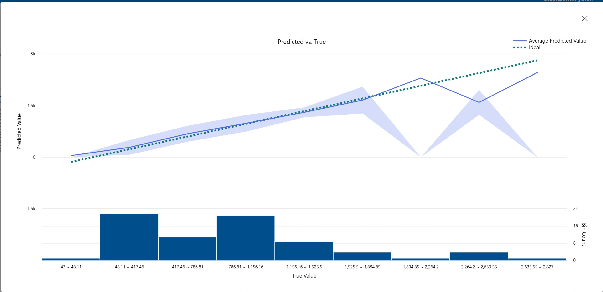
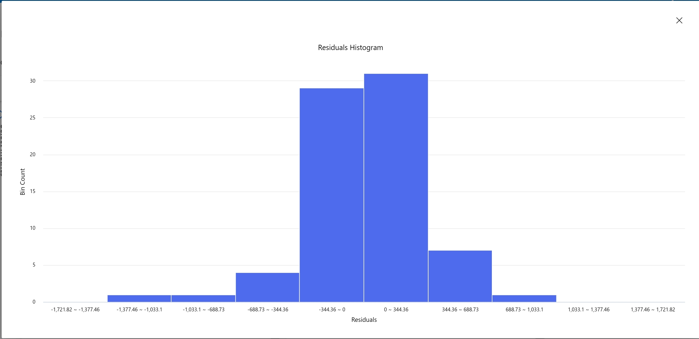

# Automated Machine Learning in Azure Machine Learning

## Introduction

In this tutorial, you will explore Automated Machine Learning (AutoML) in Azure Machine Learning. You will learn to:

- Create an Azure Machine Learning workspace
- Train a regression model using AutoML
- Evaluate the best model
  
## Prerequisites

1. Azure subscription
2. Microsoft account
3. Familiarity with basic Machine Learning concepts


## Creating an Azure Machine Learning workspace

1. Go to the Azure portal: https://portal.azure.com: https://portal.azure.com
2. Create a new resource: "Machine Learning"
3. Fill in the workspace details:
  - Name: Choose a unique name
  - Resource group: Create or select a group
  - Location: Select the nearest region
4. Wait for the workspace to be created (may take a few minutes)

## Training a model using AutoML

1. Go to Azure Machine Learning Studio: https://ml.azure.com: https://ml.azure.com
2. Select "Automated ML" under "Authoring"
3. Create a new AutoML job:
    - Job name: mslearn-bike-automl
    - Experiment name: mslearn-bike-rental
    - Description: Bike rental prediction
    - Task type: Regression
    - Dataset: Create a new dataset
        - Name: bike-rentals
        - Type: Tabular
        - Data source: Web files
        - URL: https://aka.ms/bike-rentals: https://aka.ms/bike-rentals
        - Columns: Select all except "Path"
    - Task settings:
        - Target column: Rentals (integer)
        - Primary metric: Normalized root mean squared error
        - Allowed models: RandomForest and LightGBM
        - Limits:
            - Max trials: 3
            - Max concurrent trials: 3
            - Max nodes: 3
            - Metric score threshold: 0.085
            - Timeout: 15
    - Validation and test:
        - Validation type: Train-validation split
        - Percentage of validation data: 10
    - Compute:
        - Compute type: Serverless
        - Virtual machine type: CPU
        - Virtual machine tier: Dedicated
        - Virtual machine size: Standard_DS3_V2
        - Number of instances: 1
4. Submit the training job

## Evaluating the best model

1. After the job finishes, review the best model:
    - Check the best model summary on the "Overview" tab
    - Select the algorithm name of the best model to view its details
    - Analyze the "Residuals" and "Predicted_true" charts

### Predicted versus True value



### Residuals Histogram



### Other metrics


## Testing the deployed service

1. Go to the "predict-rentals" endpoint in "Endpoints" in Azure Machine Learning Studio
2. On the "Test" tab, replace the input JSON with the following:

```json
{
  "Inputs": {
    "data": [
      {
        "day": 2,
        "mnth": 1,
        "year": 2022,
        "season": 1,
        "holiday": 0,
        "weekday": 2,
        "workingday": 3,
        "weathersit": 2,
        "temp": 0.4,
        "atemp": 0.3,
        "hum": 0.5,
        "windspeed": 0.1
      }
    ]
  },
  "GlobalParameters": 1.0
}
```

**Result**:

```json
{
  "Results": [
    261.96447636276866
  ]
}
```

3. Check if the result is on average of the espected value comparing with the metrics images

## Clean-up
1. Deleting the web service:
    - If you are done experimenting with the service, it's recommended to delete the endpoint to avoid unnecessary Azure charges.
    - In Azure Machine Learning Studio, navigate to the "Endpoints" tab.
    - Locate the "predict-rentals" endpoint and select "Delete".
    - Confirm the deletion.
2. Deleting compute resources:
    - Deleting the compute associated with the endpoint ensures you are not charged for unused resources.
    - Data storage charges may still apply as long as the 
    - Azure Machine Learning workspace exists in your subscription.
3. Deleting the Azure Machine Learning workspace:
    - Once you're finished exploring Azure Machine Learning, you can delete the workspace and associated resources.
    - In the Azure portal, navigate to the "Resource groups" page.
    - Open the resource group you specified when creating the workspace.
    - Click "Delete resource group".
    - Type the resource group name to confirm and select "Delete".
